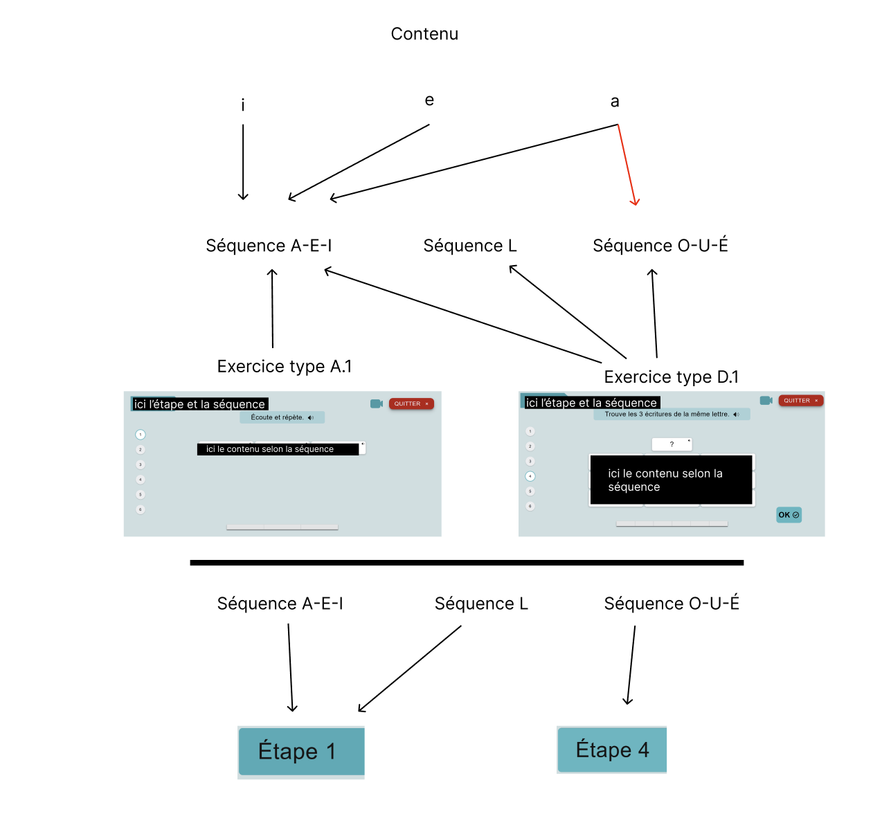
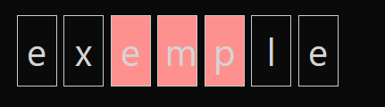
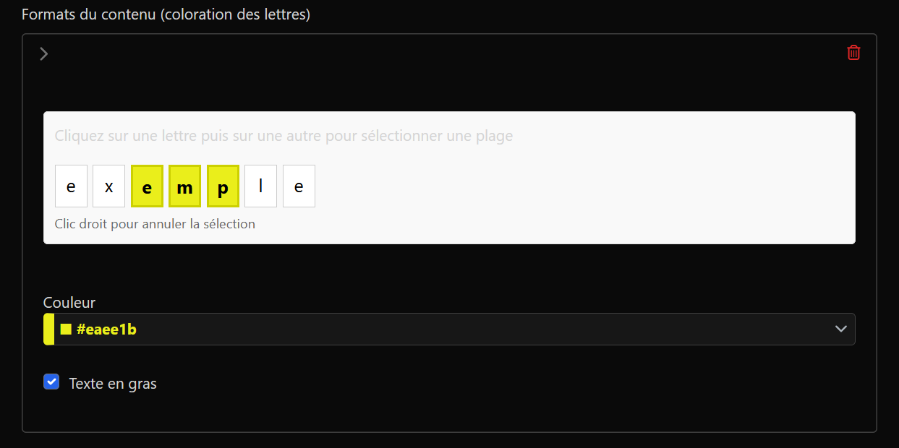

# Lettres en lumière

## Description

Lettres en lumière est une application d'aide à la lecture pour un public adulte.
Il a été imaginé à l'initiative de Camille Burr (professeur des écoles spécialisé) pour aider les personnes en détention à lire et à écrire.
Il peut fonctionner sans connexion internet.

## Installation

### Prérequis

L'installation a été testée sur les systèmes suivants :
*  Windows 7 avec Wamp 3.3.0
*  Windows 11 avec Wamp 3.3.7

Vous trouverez ci-dessous les logiciels requis pour faire fonctionner l'application :

Pour la synthèse vocale sous chrome sans connexion internet :
https://www.microsoft.com/en-us/download/details.aspx?id=27225

Pour les voix françaises de la synthèse vocale sous chrome avec connexion internet :
https://www.microsoft.com/en-us/download/details.aspx?id=27224

Fichier de registre pour windows 7 :

Site pour les Visual C++ Redistributable Runtimes :
https://github.com/abbodi1406/vcredist

Documentation à jour de Wamp :
http://forum.wampserver.com/read.php?1,137154

### Étapes d'installation

1. **Copie des fichiers :**
   * Pour davantage de rapidité, vous devez copier les fichiers d'installation de votre clé USB vers le disque dur.

2. **Installation des prérequis :**
   * Installez tous les Microsoft Visual C++ Redistributable Runtimes

3. **Installez Wamp :**
   * Choisissez la version adéquate :
     * 3.3.0 pour Windows 7/8
     * 3.3.7 pour Windows 10/11
    
4. **Téléchargez le zip du projet :**
Le zip du projet est disponible dans la partie "Releases" du dépôt GitHub.
   * Téléchargez la dernière version stable de l'application Lettres en lumière.
   * Le fichier sera nommé `lettresenlumiere.zip`.

5. **Extraire le zip dans le dossier C:\wamp64\www\lettresenlumiere :**

6. **Configuration de l'application :**
    * Lancez Wamp et assurez-vous qu'il est en ligne (icône verte dans la barre des tâches).
    * Pour Windows 7, passez Php en version 8.2 (clic droit sur l'icône Wamp dans la barre des tâches, sélectionnez "PHP" puis "Version" et choisissez 8.2).
    * Lancez `create_data.bat` dans `C:\wamp\www\lettresenlumiere\` (double clic)
        * Il ne doit pas avoir de message d'erreur. À la fin, vous pouvez voir l'adresse IP de votre serveur local.
    * Relancez les services Wamp (clic sur l'icône Wamp dans la barre des tâches et sélectionnez "Redémarrer tous les services").

## Utilisation

Pour une utilisation optimale de l'application, nous vous recommandons les navigateurs suivants :
* Edge (la synthèse vocale fonctionne mieux)
* Chrome (vous devez installer les voix françaises pour la synthèse vocale en utilisation hors ligne)

1. **Accéder à l'application :**
    * Sur le poste où l'application est installée, ouvrez votre navigateur et allez à l'URL configurée `http://localhost/lettresenlumiere'.
    * Sur les autres postes, remplacez `localhost` par l'adresse IP du poste où l'application est installée (par exemple `http://192.168.1.1/lettresenlumiere`).

2. **Administration du contenu :**
Vous pouvez ajouter, modifier ou supprimer des contenus, des étapes, des séquences... via l'interface d'administration.
    * Ouvrez votre navigateur et allez à l'URL configurée `http://localhost/lettresenlumiere/admin'.
    * **Identifiant :** admin
    * **Mot de passe :** 123456789 (par défaut)
    * Vous pouvez modifier le mot de passe dans l'interface d'administration en cliquant sur votre profil en haut à droite.

## Gestion des contenus :

### Insertion manuelle de nouveaux contenus :
Pour insérer ou modifier des contenus, rendez-vous à `localhost/lettresenlumiere/admin` et connectez-vous avec les identifiants depuis le pc hôte.
D'ici, vous pourrez accéder aux étapes, contenus, séquences et exercices de l'application.

**Chaque contenu** appartient à **une ou plusieurs séquences** possédant elle-même **plusieurs exercices**. **Une étape** est composée de **plusieurs séquences**. **Chaque étape** est **indépendante** des autres.

Vous pourrez ainsi créer un contenu et l'affecter à un ou plusieurs exercices types, choisir la syllabe à **cacher** tel que :

Ici `emp` sera caché à l'affichage et l'utilisateur devra le trouver.

Notez que cette fonctionnalité n'est nécessaire et donc disponible que pour les exercices C.2 bis et E.2 bis.

Aussi, vous pouvez **colorer** une partie du contenu entré de la couleur choisie tel que :

Ici, toujours, `emp` sera coloré et en **gras** quand le mot apparaîtra dans l'exercice.

Vous pouvez aussi assigner une **image** ou un **son** associé au contenu si c'est pertinent. **Tous les exercices ne prennent pas en charge ces fonctionnalités**.

## Mise à jour de l'application

Pour mettre à jour l'application, suivez ces étapes :
1. **Récupération de la dernière version sur github :**
   * Supprimez le dossier `C:\wamp64\www\lettresenlumiere`.
   * Téléchargez la dernière version stable de l'application Lettres en lumière depuis la partie "Releases" du dépôt GitHub.
   * Le fichier sera nommé `lettresenlumiere.zip`.
   * Extrayez le zip dans le dossier `C:\wamp64\www\lettresenlumiere`.
   * Lancez `create_data.bat` dans `C:\wamp64\www\lettresenlumiere\` (double clic).

## Partie Technique

### Technologies Utilisées

*   **Backend :** PHP sous Symfony 7
*   **Frontend :** React.js 19
*   **Builder :** Webpack Encore
*   **Framework CSS :** Tailwind CSS
*   **Base de données :** MariaDB
*   **Serveur Web :** Apache (inclus dans Wamp)
