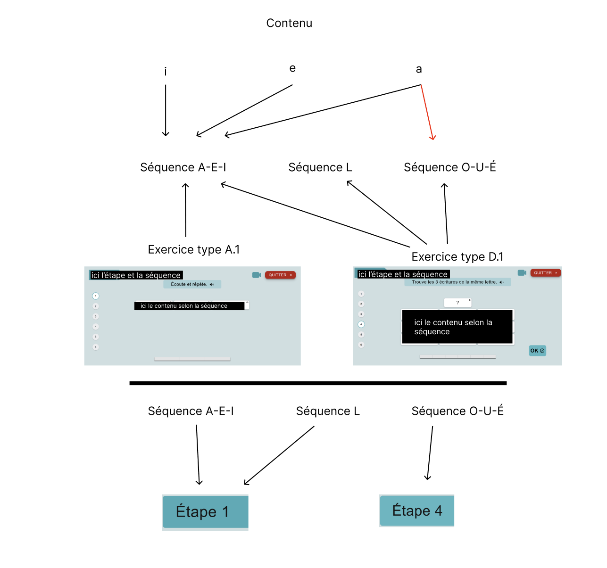
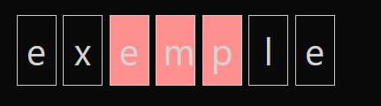
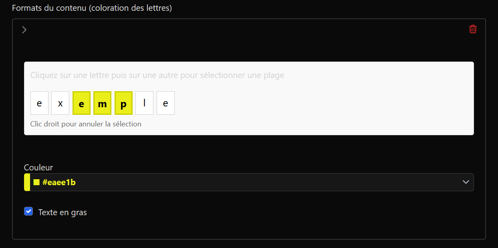

# Lettres en lumière

## Description

Lettres en lumière est une application d'aide à la lecture pour un public adulte.
Il a été imaginé à l'initiative de Camille Burr (professeur des écoles spécialisé) pour aider les personnes en détention à lire et à écrire.
Il peut fonctionner sans connexion internet.

## Installation

Voir la [documentation](doc/installation.md).

## Utilisation

Pour une utilisation optimale de l'application, nous vous recommandons les navigateurs suivants :
* Edge
* Chrome
* Firefox

1. **Accéder à l'application :**
    * Sur le poste où l'application est installée, ouvrez votre navigateur et allez à l'URL configurée `http://localhost/lettresenlumiere'.
    * Sur les autres postes, remplacez `localhost` par l'adresse IP du poste où l'application est installée (par exemple `http://192.168.1.1/lettresenlumiere`).

2. **Administration du contenu :**
Vous pouvez ajouter, modifier ou supprimer des contenus, des étapes, des séquences... via l'interface d'administration.
    * Ouvrez votre navigateur et allez à l'URL configurée `http://localhost/lettresenlumiere/admin'.
    * **Identifiant :** admin
    * **Mot de passe :** 123456789 (par défaut)
    * Vous pouvez modifier le mot de passe dans l'interface d'administration en cliquant sur votre profil en haut à droite.

## Gestion des contenus :

### Insertion manuelle de nouveaux contenus :
Pour insérer ou modifier des contenus, rendez-vous à `localhost/lettresenlumiere/admin` et connectez-vous avec les identifiants depuis le pc hôte.
D'ici, vous pourrez accéder aux étapes, contenus, séquences et exercices de l'application.

**Chaque contenu** appartient à **une ou plusieurs séquences** possédant elle-même **plusieurs exercices**. **Une étape** est composée de **plusieurs séquences**. **Chaque étape** est **indépendante** des autres.




Vous pourrez ainsi créer un contenu et l'affecter à un ou plusieurs exercices types, choisir la syllabe à **cacher** tel que :

Ici `emp` sera caché à l'affichage et l'utilisateur devra le trouver.


Notez que cette fonctionnalité n'est nécessaire et donc disponible que pour les exercices C.2 bis et E.2 bis.

Aussi, vous pouvez **colorer** une partie du contenu entré de la couleur choisie tel que :


Ici, toujours, `emp` sera coloré et en **gras** quand le mot apparaîtra dans l'exercice.

Vous pouvez aussi assigner une **image** ou un **son** associé au contenu si c'est pertinent. **Tous les exercices ne prennent pas en charge ces fonctionnalités**.

## Partie Technique

### Technologies Utilisées

*   **Backend :** PHP sous Symfony 7.4
*   **Frontend :** React.js 19
*   **Builder :** Webpack Encore
*   **Framework CSS :** Tailwind CSS
*   **Base de données :** MariaDB
*   **Serveur Web :** Apache (inclus dans Wamp)

### Collaboration et Contributions

- Pour lancer l'application en local à la main, il faut placer un fichier env.js dans le dossier public/js avec le contenu suivant :
```javascript
const BASE_ROUTE = ''; // Remplacer par /dossier_installation si l'application est dans un sous-dossier
export default BASE_ROUTE;
```

### Crédits

Ce projet est issu d'une initiative de Camille Burr, professeur des écoles spécialisé, et a été développé par des étudiants de la licence professionnelle MIAW de La Rochelle Université sur trois années.
Merci à eux pour leur travail et leur engagement sans faille dans ce projet.
- La première année a permis de faire un POC (Proof of Concept) de l'application et de définir toute la charte graphique et l'ergonomie de l'application.
  - Victoria TANDAMBA
  - Marilyne Delia TSENE
  - Clarence NOIROT
  - Loane SENE
- La deuxième année a permis de développer l'application et de la mettre en production.
  - Baptiste Pereira
  - Maxence Hirault
  - Raphaël Benmimoune
  - Johan Canevet-Danois
  - Angelo Palmino
- La troisième année a permis de faire évoluer l'application avec la création de compte utilisateur et le suivi des progressions pédagogiques.
  - Maxime Chasles
  - Jules Bossis-Guyon
  - Mathis Gaudré
  - Lisa Weermeer

Je continue de travailler sur cette application de manière bénévole pour l'améliorer et la faire évoluer.

Je suis ouvert à toute collaboration et contribution pour améliorer l'application et la rendre plus accessible à un public plus large.
