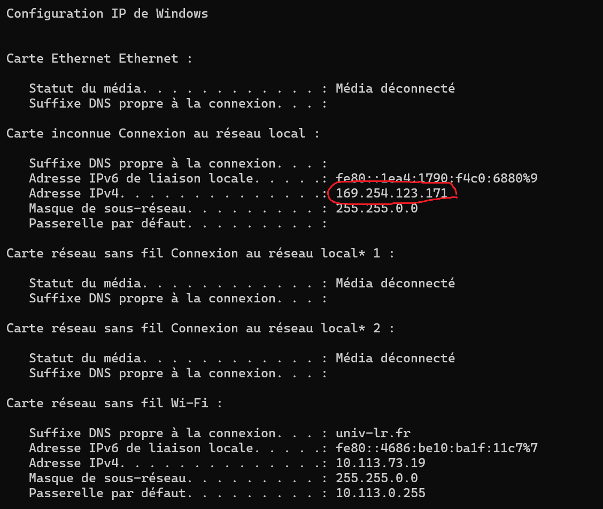
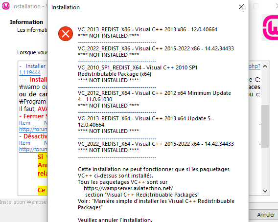
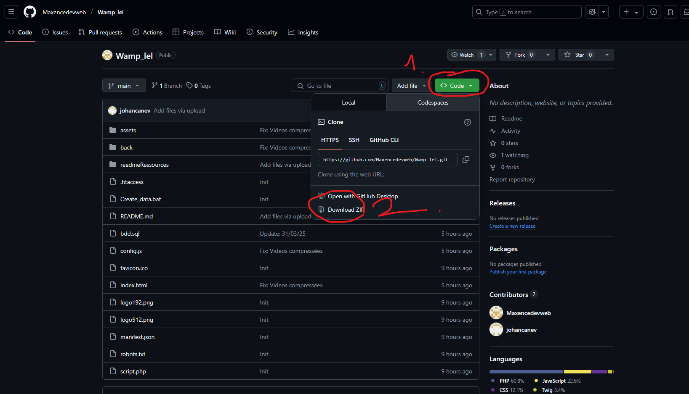
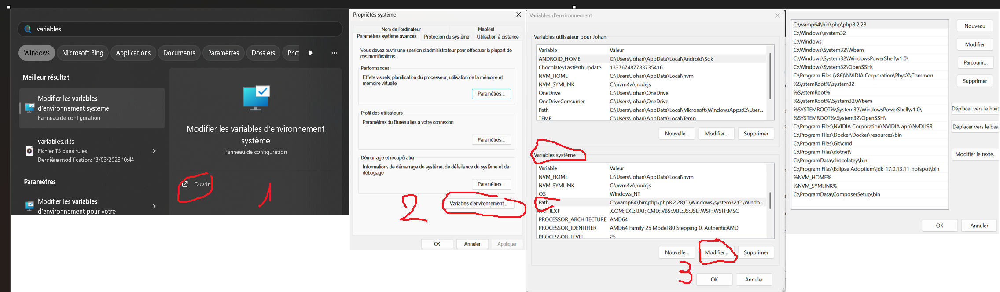
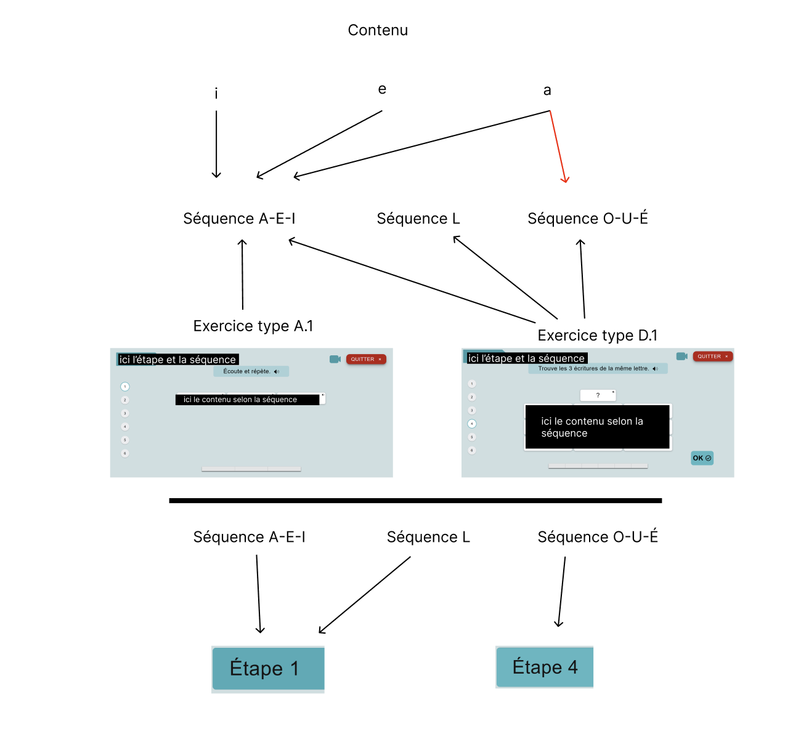
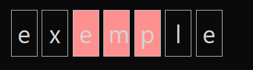
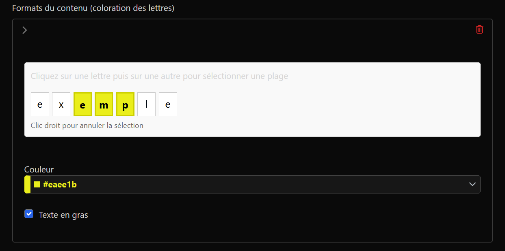
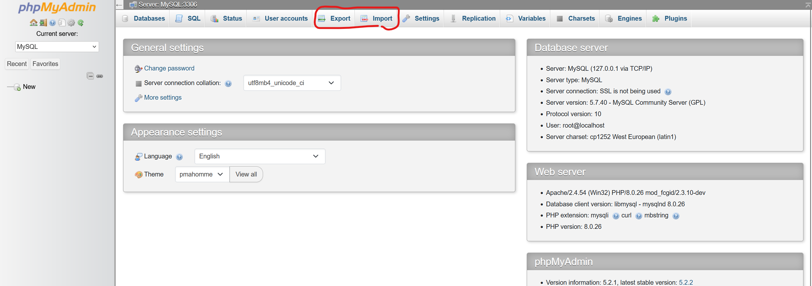
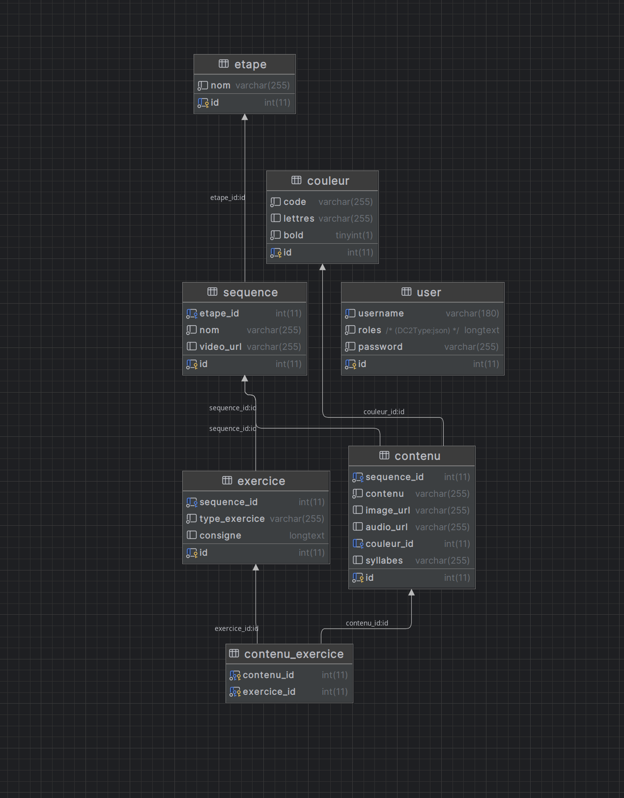
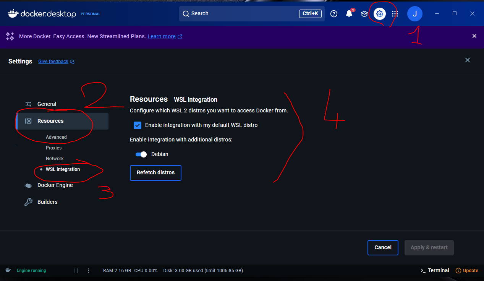

# Documentation du projet

## Sommaire :

1. Tuto utilisateur :
    - [x] Setup
        -  [Environnement d'utilisation](#environnement-dutilisation-)
        -  [Guide d'installation](#guide-dinstallation-)
        -  [Troubleshooting](#troubleshooting)

    -  [x] [Gestion des contenus](#partage-des-contenus-)
        - [Insertion manuelle de nouveaux contenus](#insertion-manuelle-de-nouveaux-contenus-)
        - [Exporter ses contenus](#partage-des-contenus-)
        - [Importer des contenus](#partage-des-contenus-)
        - [Remédier à la perte des contenus](#partage-des-contenus-)

            

2. Partie développment : 
    - [x] [Environnement de développement](#lenvironnement-de-d%C3%A9velopement-)
    - [x] [Front](#front-)
        - Dépendances principales
        - Dépendances de développement
        - Structure du projet
    
    - [Back](#back-)
        - [Structure de la BDD](#sgbdr-système-de-gestion-de-base-de-données-relationnelle-)
        - Dépendances principales
        - Dépendances de développement
        - [APIs]() TODO

--- 

### __Tuto utilisateur__ :

#### Environnement d'utilisation :

 - **Système d'exploitation** : Windows (éviter les versions trop datées type Windows XP, le projet a été développé et testé sur windows 10 et plus)
 - **Navigateur supporté :** [Edge](https://support.microsoft.com/fr-fr/microsoft-edge/t%C3%A9l%C3%A9charger-le-nouveau-microsoft-edge-bas%C3%A9-sur-chromium-0f4a3dd7-55df-60f5-739f-00010dba52cf) (d'autres navigateurs comme Chrome ou Mozilla devraient fonctionner mais des problèmes pourraient survenir.)
 - **Lien d'accès** si WAMP est installé sur chaque pc : http://localhost/
 - **Lien d'accès** si les pc sont connectés en réseau sur la machine ayant installé WAMP : 
    1. Rendez-vous sur le pc hôte de WAMP, appuyez sur <kbd>⊞ Win</kbd> + <kbd>R</kbd>
    2. Tappez `cmd` puis appuez sur <kbd>Entrée</kbd>
    3. Vous êtes maintenant dans la console, tappez `ipconfig` puis <kbd>Entrée</kbd>
    4. Notez la valeur de l'adresse **IPv4**
    
    5. Avec les pc utilisateurs connectés au pc serveur, rendez vous à http:/**la valeur de votre IPv4**/


#### Guide d'installation :

 1. Installer [WAMP](https://www.wampserver.com/) dans sa version x64

 2. Si ce genre de message apparaît pendant l'installation, pas de panique, installez simplement les distributions de Visual C++ indiquées depuis le site de Wamp à https://wampserver.aviatechno.net/ **section Visual C++ Redistributable Packages**.

 

 3. **Téléchargez** et **décompressez** le contenu du dépôt git à `https://github.com/Maxencedevweb/Wamp_lel`. Pour décompresser un dossier.zip vous pouvez utiliser [7zip](https://www.7-zip.org/).

 

 4. Rendez vous à `C:\wamp64\www` et **créez** un **dossier** lel puis placez-y le contenu décompressé que vous venez d'obtenir.

 5. Lancez le serveur **WAMP** en double cliquant sur  wampserver.exe dans C:/Wamp 

 6. Lancez `create_data.bat` dans C:/wamp/www/lel/ (double clique)

 7. **Votre serveur est prêt !** Votre base de données accessible à http://localhost/phpmyadmin/ sous l'utilisateur root - Mot de passe vide - Choix du serveur MariaDB.

#### 🛠️Troubleshooting🛠️
Si vous rencontrez des problèmes, notamment relatifs au chargement des contenus, ceux-ci peuvent résulter de plusieurs cause.

- Tout d'abord assurez vous d'utiliser le navigateur Edge, si ce n'était pas le cas, lancez le projet avec et vérifiez le chargement des étapes à `localhost/etapes` ou l'accès au site.    
- Une version Php trop datée : Notre projet tourne en Symfony 7.1.8, il est conseillé d'utiliser Php 8.2.28 pour le faire fonctionner.
Vous pouvez vérifier la version Php utilisée via **Windows**  -> invite de commandes -> `php -v` sinon via
**Windows**  -> Modifier les variables d'environnement système -> Variables d'environnement... -> Variables système -> path -> supprimer l'ancien php et ajouter le nouveau présent en principe à `C:\wamp64\bin\php\php8.2.28` puis la mettre en haut de la liste et enfin appuyer sur OK dans les fenêtres de variables d'environnement pour valider le changement.


- Il est aussi possible que vous ayez à exécuter composer install dans le dossier `C:\wamp64\www\back>`, pour se faire, installez [composer]( https://getcomposer.org/Composer-Setup.exe) en suivant les instruction de l'installateur, puis depuis l'invites de commande windows, tappez `cd C:\wamp64\www\back` puis **Entrée** puis `composer install`

### Gestion des contenus :

#### Insertion manuelle de nouveaux contenus :
Pour insérer ou modifier des contenus, rendez-vous à `localhost/back/admin` et connectez vous avec les identifiants depuis le pc hôte.
D'ici, vous pourrez accéder aux étapes, contenus, séquences et exercices de l'application.

**Chaque contenu** appartient à **une ou plusieurs séquences** possédant elle-même **plusieurs exercices**. **Une étape** est composée de **plusieurs séquences**. **Chaque étape** est **indépendante** des autres.




Vous pourrez ainsi créer un contenu et l'affecter à un ou plusieurs exercices types, choisir la syllabe à **cacher** tel que :

Ici `emp` sera caché à l'affichage et l'utilisateur devra le trouver.


Notez que cette fonctionnalité n'est nécessaire et donc disponible que pour les exercices C.2 bis et E.2 bis.

Aussi, vous pouvez **colorer** une partie du contenu entré de la couleur choisie tel que : 


Ici, toujours, `emp` sera coloré et en **gras** quand le mot apparaîtra dans l'exercice.

Vous pouvez aussi assigner une **image** ou un **son** associé au contenu si c'est pertinent. **Tous les exercices ne prennent pas en charge ces fonctionnalités**.

La création d'**exercice, de séquence ou d'étape** nécessite du **développement** côté front pour être opérationnelle.

#### Partage des contenus :

**Cette fonctionnalité n'étant pas prévue à l'origine, elle est incomplète. Il est possible de partager les données sql mais pas les images, sons et couleurs associées, ceux-ci devront être insérés à la main depuis la page gestion des contenus**

Il est possible de partager des contenus d'un serveur à l'autre via des fichiers `.sql`. Il faudra alors :
    
- Soit **exporter** votre fichier si vous souhaitez **partager** vos contenus. Pour **exporter** vos contenus, rendez vous à 
http://localhost/phpmyadmin/index.php **sur le pc ayant WAMP installé**, connectez vous sous l'**utilisateur** `root` - **Mot de passe vide** - Choix du serveur `MariaDB` sauf si vous avez **modifié les accès** ce qui est **recommandé**. De là, cliquez sur `Export` en haut de la page, puis `Export` dans le corps de la page. Vous obtiendrez alors votre fichier `.sql`.
    
- Soit **importer** un fichier si vous souhaitez **recevoir** celui de quelqu'un d'autre. Pour **importer** des contenus, rendez vous à http://localhost/phpmyadmin/index.php ** sur le pc ayant WAMP installé**, connectez vous sous l'**utilisateur** `root` - **Mot de passe vide** - Choix du serveur `MariaDB` sauf si vous avez **modifié les accès** ce qui est **recommandé**. De là, cliquez sur `Import` en haut de la page, puis `Import` dans le corps de la page. Vous obtiendrez alors votre fichier `.sql`.
    


- **⚠️ ATTENTION ⚠️** Si par mégarde vous **perdez** le fichier contenant vos contenus ou **l'écrasez** avec un autre, vous pouvez **retrouver** le fichier initial à [fichiersql](TODO). Il est **recommandé** de garder une **sauvegarde** de votre fichier `.sql` de côté pour **prévenir une perte des données**.

### __Partie développement :__ 

### __L'environnement de dévelopement__ : 

#### Front :

##### React 18.3.1 avec Vite


###### Dépendances principales
- [**React**](https://fr.react.dev/)
- [**ReactDOM**](https://fr.react.dev/reference/react-dom)
- [**React Router DOM**](https://reactrouter.com/)
- [**Framer Motion**](https://motion.dev/)
- [**@react-pdf/renderer**](https://react-pdf.org/)
- [**dotenv**](https://www.npmjs.com/package/dotenv)

###### Dépendances de développement
- [**@vitejs/plugin-react**](https://www.npmjs.com/package/@vitejs/plugin-react)
- [**TailwindCSS**](https://tailwindcss.com/docs/installation/using-vite)
- [**Sass**](https://sass-lang.com/documentation/)
- [**PostCSS**](https://postcss.org/docs/)
- [**Autoprefixer**](https://www.npmjs.com/package/autoprefixer)
- [**ESLint**](https://eslint.org/)
- [**@eslint/js**](https://www.npmjs.com/package/@eslint/js)
- [**eslint-plugin-react**](https://www.npmjs.com/package/eslint-plugin-react)
- [**eslint-plugin-react-hooks**](https://www.npmjs.com/package/eslint-plugin-react-hooks)
- [**eslint-plugin-react-refresh**](https://www.npmjs.com/package/eslint-plugin-react-refresh)
- [**@types/react**](https://www.npmjs.com/package/@types/react)
- [**@types/react-dom**](https://www.npmjs.com/package/@types/react-dom)
- [**React Error Overlay**](https://www.npmjs.com/package/react-error-overlay)
- [**Globals**](https://www.npmjs.com/package/globals)
- [**Vite**](https://vite.dev/guide/)

###### Structure du projet

```
+---src
|   |   App.jsx <!-- Fichier de rendu principal-->
|   |   index.css 
|   |   main.jsx
|   |
|   +---api
|   |       alphabet.json
|   |       exercice.json
|   |       graphèmes.json
|   |       sequence.json
|   |
|   +---assets
|   |   +---fonts
|   |   |       BelleAllureGS-Fin.otf
|   |   |       Cursive.ttf
|   |   |       Helvetica.woff
|   |   |
|   |   +---images
|   |   |       (images de l'interface ici…)
|   |   |
|   |   +---sons
|   |   |   +---apprentissage
|   |   |   |       error-sound.mp3
|   |   |   |       reward-sound.mp3
|   |   |   |
|   |   |   \---graphemes
|   |   |           an.mp3
|   |   |           au.mp3
|   |   |           eu.mp3
|   |   |           ...
|   |   |
|   |   \---videos
|   |           a-e-i.mp4
|   |           favicon.ico
|   |           l.mp4
|   |           ...
|   |
|   +---components
|   |       Consigne.jsx
|   |       Header.jsx
|   |       Sidebar.jsx
|   |       ...
|   |
|   |
|   +---hooks
|   |   |   useSpeak.js
|   |   |
|   |   \---api
|   |           useDataEtapes.js
|   |           useDataExercice.js
|   |
|   |
|   +---pages
|   |       Layout.jsx <!-- Fichier de rendu des exercices. C'est ce fichier qui passe les données à un exercice selon son type et qui gère la navigation entre les pages ainsi que le stockage de la progression de session.-->
|   |
|   |       AlphabetPage.jsx
|   |       Credits.jsx
|   |       EtapesPage.jsx
|   |       ...
|   |
|   \---scss
|       |   main.scss
|       |
|       +---base
|       |       _base.scss
|       |       _fonts.scss
|       |       ...
|       |
|       +---components
|       |       _accordion.scss
|       |       _buttons.scss
|       |       ...
|       |
|       \---pages
|               _alphabetPage.scss
|               _etapesPage.scss
|               ...
|
+---public
        favicon.ico
        index.html
        logo192.png
        logo512.png
        manifest.json
        robots.txt


```
---

#### Back :

##### SGBDR (Système de Gestion de Base de Données Relationnelle) : 

MariaDB 10.11.8

##### Schéma relationnel :


##### Symfony 7.1.8

###### Bundles utilisés :

###### Bundles activés dans tous les environnements
- [**FrameworkBundle**](https://symfony.com/components/Framework%20Bundle)
- [**TwigBundle**](https://symfony.com/components/Twig%20Bundle)
- [**SecurityBundle**](https://symfony.com/doc/current/security.html)
- [**DoctrineBundle**](https://symfony.com/bundles/DoctrineBundle/current/index.html)
- [**DoctrineMigrationsBundle**](https://symfony.com/bundles/DoctrineMigrationsBundle/current/index.html)
- [**NelmioCorsBundle**](https://symfony.com/bundles/NelmioCorsBundle/current/index.html)
- [**ApiPlatformBundle**](https://api-platform.com/docs/v2.1/core/getting-started/)
- [**EasyAdminBundle**](https://symfony.com/bundles/EasyAdminBundle/current/index.html)
- [**TwigExtraBundle**](https://github.com/twigphp/twig-extra-bundle)
- [**TwigComponentBundle**](https://symfony.com/bundles/ux-twig-component/current/index.html)
- [**StimulusBundle**](https://symfony.com/bundles/StimulusBundle/current/index.html)
- [**ChartjsBundle**](https://symfony.com/bundles/ux-chartjs/current/index.html)

###### Bundles activés en développement (`dev`)
- [**MakerBundle**](https://symfony.com/bundles/SymfonyMakerBundle/current/index.html)
- [**WebProfilerBundle**](https://symfony.com/components/WebProfiler%20Bundle)
- [**DoctrineFixturesBundle**](https://symfony.com/bundles/DoctrineFixturesBundle/current/index.html)

###### Bundles activés en développement et test (`dev`, `test`)
- [**WebProfilerBundle**](https://symfony.com/components/WebProfiler%20Bundle)
- [**DoctrineFixturesBundle**](https://symfony.com/bundles/DoctrineFixturesBundle/current/index.html)


#### APIs

- https://back.localhost:8443/api/custom/sequences

- https://back.localhost:8443/api/custom/etapes

#### Si vous souhaitez uniquement le compose.yaml :

[Trouvez-le ici](readmeRessources/compose.yaml).


#### Si vous souhaitez installer la stack de développment complète :

 1. Installer [Docker Desktop](https://www.docker.com/products/docker-desktop/)

 2. Installer [Debian](https://apps.microsoft.com/detail/9msvkqc78pk6?hl=fr-FR&gl=FR)

 3. Activer l' **intégration WSL** dans les paramètres de **Docker Desktop**.



(n'hésitez pas à cliquer sur 'Reftech distros' si debian ne s'affiche pas)

 4. Installer [Git](https://git-scm.com/downloads)

 5. Dans votre explorateur de fichiers, vous rendre à `\\wsl.localhost\Debian\home\{nom de l'utilisateur}` et **créez un nouveau dossier** que vous nommerez **LeL**

 6. Entrez dans ce dossier et <kbd>clic droit<kbd> -> `Open Git Bash here`

 7. Vous êtes maintenant dans un console de commande, dedans, tapez `git clone https://gitlab.univ-lr.fr/ntrugeon/docker-symfony-wp-2024.git` puis appuyez sur <kbd>Entrée<kbd>. 
 Si le processus réussi, vous pouvez passer à la suite.


 8. Dans votre explorateur de fichiers, vous devriez voir un nouveau dossier nommé **docker-symfony-wp-2024**.

 9. Appuyez sur la touche **Windows** et tappez **Debian** puis appuyez sur la touche <kbd>Entrée<kbd>

 10. Vous êtes maintenant dans une console. Tappez `cd  LeL/docker-symfony-wp-2024` puis appuyez sur <kbd>Entrée<kbd>.

 11. make existingProject ???

 12. Toujours dans la console, tappez `make up` et appuyez sur <kbd>Entrée<kbd> (**Docker Desktop** doit être démarré).

 13. Vous pouvez maintenant accéder au backend via `https://{nom-du-projet}.localhost:8443/` dans votre navigateur.

- Détails de la stack docker à  : https://gitlab.univ-lr.fr/ntrugeon/docker-symfony-wp-2024, [(tutoriel)](https://gitlab.univ-lr.fr/ntrugeon/docker-symfony-wp-2024/-/blob/main/doc/MACHINEPERSOWINDOWS.md) 

#### Pour relancer le back une fois l'environnement déjà installé :
 
 1. Lancer **Docker Desktop**

 2. Appuyez sur la touche <kbd>⊞ Win</kbd> et tappez **Debian** puis appuyez sur la touche <kbd>Entrée<kbd>.

 3. Vous êtes maintenant dans une console. Tappez `cd  LeL/docker-symfony-wp-2024` puis appuyez sur <kbd>Entrée</kbd>.

 4. Toujours dans la console, tappez `make up` et appuyez sur <kbd>Entrée<kbd>.

 5. Vous pouvez maintenant accéder au backend via https://{nom-du-projet}.localhost:8443/ dans votre navigateur.

