# Installation de Lettres En Lumière sur windows 10/11 connecté au réseau

## Installation de Wamp

Sur un poste connecté au réseau, il faut récupérer les applications suivantes et les mettre sur une clé usb.

1. Visual C++ Redistribuable  
Il faut récupérer la version x86\_x64 sur [https://github.com/abbodi1406/vcredist/releases](https://github.com/abbodi1406/vcredist/releases)   
Par exemple au 29/09/2026

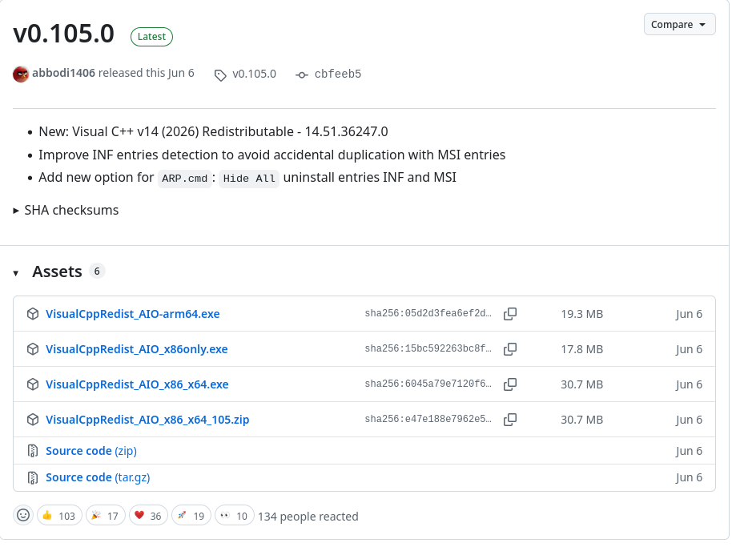

2. [Wamp](https://wampserver.aviatechno.net/files/install/wampserver3.4.0_x64.exe) en version 3.4.0 (dernière version testée)

3. Le logiciel lettresenlumiere.zip est téléchargeable depuis l’adresse suivante : [https://github.com/nicolasunivlr/lettresenlumiere/releases](https://github.com/nicolasunivlr/lettresenlumiere/releases) en prenant la dernière version.

4. Un navigateur moderne **si ce n’est pas déjà présent sur les postes**. Vous pouvez choisir Chrome, Firefox ou Edge. Il faut trouver des installateurs hors ligne de ces logiciels.

Copiez sur une clé usb tous ces logiciels. Vous laisserez tous les paramètres par défaut lors des installations.

Un compte administrateur de la machine est nécessaire.

Une fois la clé usb prête, il faut brancher la clé sur le poste serveur, il faut recopier l'ensemble des fichiers sur le bureau. Cela est plus rapide et évite des messages de sécurité lors de l'installation.

Installez dans l'ordre les logiciels suivants :

1. VisualCppRedis

2. Wamp64

3. (Facultatif) Un navigateur.

## Installation de l’application

2. On recopie le fichier lettresenlumiere.zip de la clé usb sur le bureau. (cela est déjà fait normalement... ;) )  

3. On dézippe le fichier lettresenlumiere.zip dans le dossier c:\\wamp64\\www\\lettresenlumiere. Clic droit Nouveau dossier

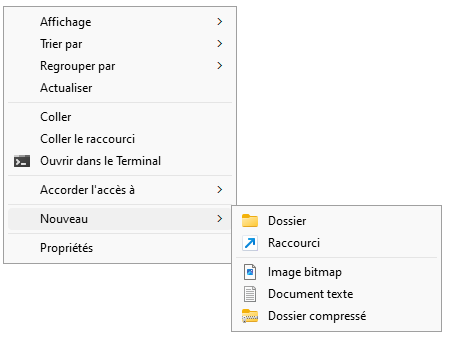

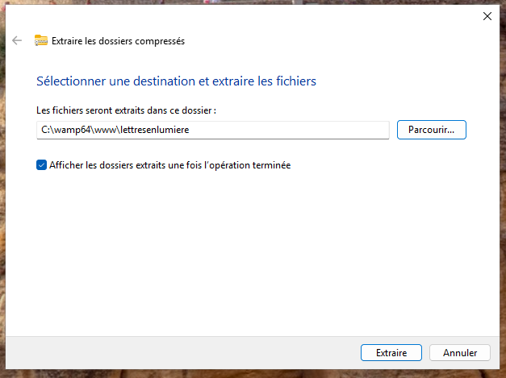

4. Une fois les fichiers du zip copiés (environ 2 minutes), il suffit de lancer l’installation des données en double cliquant sur installation.bat

5. Cela doit afficher une fenêtre texte qui dit que tout s’est bien passé normalement.

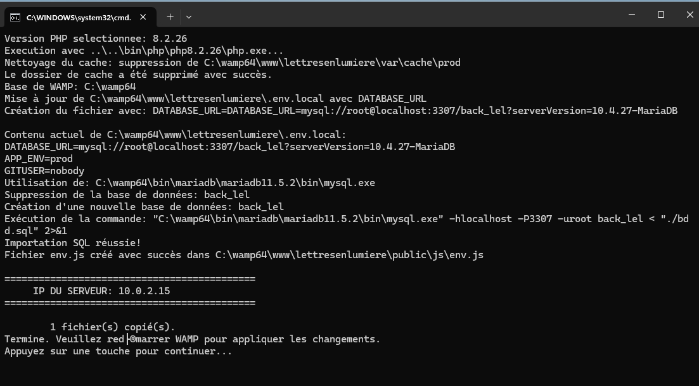  
Notez bien l’adresse IP qui s’affiche, il servira pour proposer l’application à tous les postes d'une salle informatique.

6. Il ne reste plus qu’à redémarrer les services de wamp. On peut également fermer wamp et le relancer.

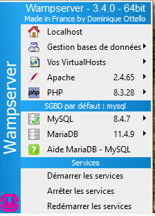

7. L’application est disponible sur le poste en ouvrant un navigateur internet (edge, firefox ou chrome) et en allant sur [http://localhost/lettresenlumiere](http://localhost/lettresenlumiere) sur le poste serveur pour vérifier que tout fonctionne correctement.

Pour les postes dans les salles de classe, ouvrir un navigateur internet (edge, firefox ou chrome) et aller sur http://adresse\_ip\_noté\_précédemment/lettresenlumiere.

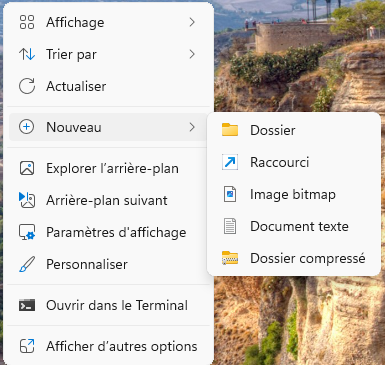

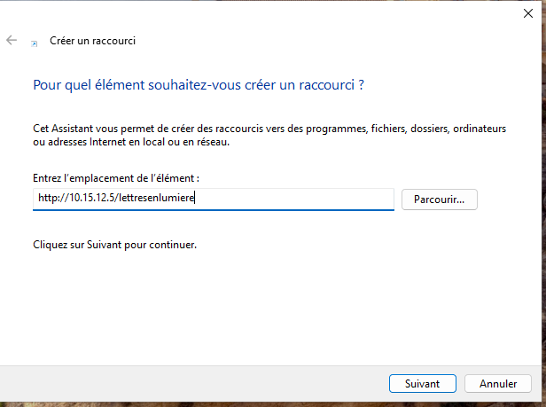

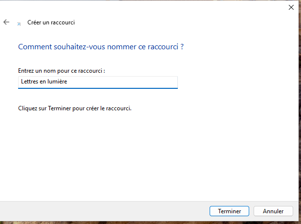

8. Il est possible de créer un raccourci disponible partout en allant sur le dossier partagé Travail puis clic-droit, Nouveau raccourci et mettre : http://adresse\_ip\_noté\_précédemment/lettresenlumiere, par exemple [http://10.2.2.5/lettresenlumiere](http://10.2.2.5/lettresenlumiere)

## Démarrage automatique de Wamp

Vous pouvez configurer Wamp pour qu’il démarre automatiquement au démarrage de Windows. Pour cela, il faut modifier les services de Windows. Cherchez "Services" dans le menu démarrer et ouvrez l’application.

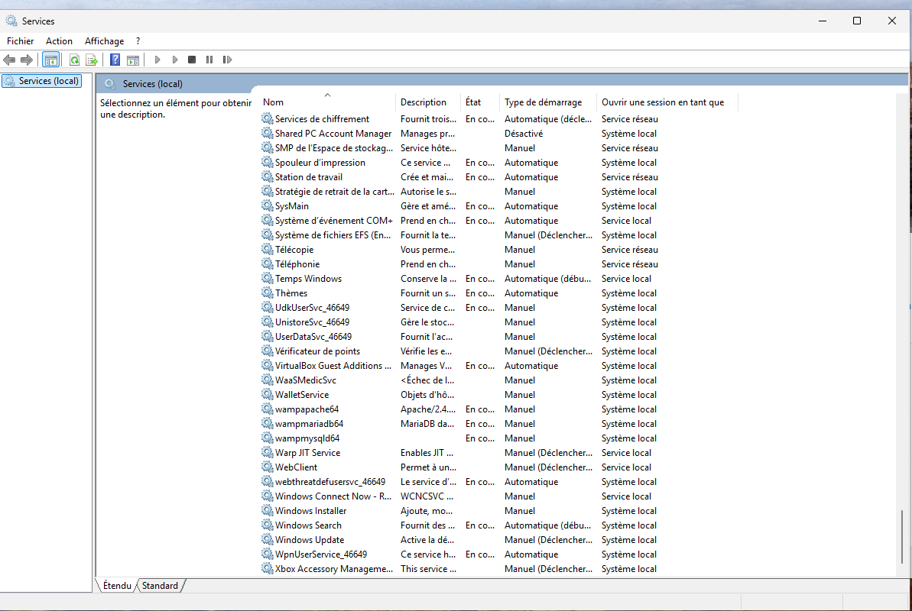

En bas de la fenêtre, cherchez "WampApache64" et double-cliquez dessus. Dans le menu déroulant "Type de démarrage", choisissez "Automatique". Cliquez sur "Appliquer" puis sur "OK".

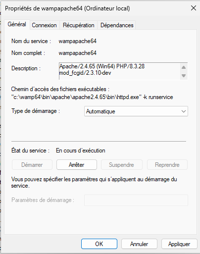

Il faut faire la même chose pour le service "WampMariadb64".

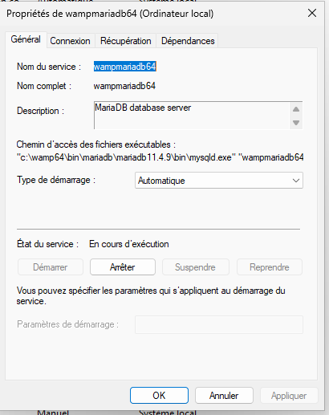

## Sécurisation de l'application

Par défaut, l'administration de l'application est accessible depuis le compte `admin` avec le mot de passe `123456789`. 
Il est fortement recommandé de changer ce mot de passe dès l'installation terminée pour une sécurité accrue.
Pour cela, connectez-vous avec ce compte, allez dans `Administration` puis cliquer en haut à droite sur l'avatar de votre compte puis sur `Modifier le mot de passe`.

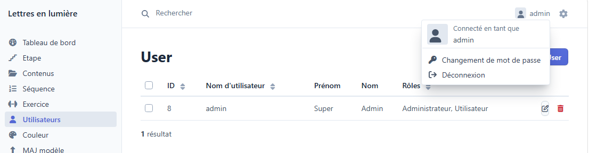

## Mise à jour de l'application

Pour mettre à jour l'application, il suffit de télécharger la dernière version de lettresenlumiere.zip depuis [le site officiel](https://github.com/nicolasunivlr/lettresenlumiere).

> [!WARNING]
> La mise à jour de l'application supprime toutes les données de l'application :
> - comptes utilisateurs
> - progressions des apprenants

Supprimez le dossier `c:\wamp64\www\lettresenlumiere` et dézippez la nouvelle version dans un nouveau dossier lettresenlumiere dans c:\wamp64\www.

Ensuite, relancez l'installation des données en double cliquant sur `installation.bat`.
