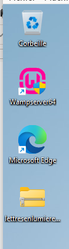
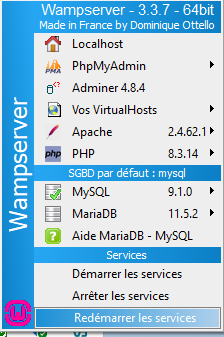

# Installation de Lettres En Lumière sur un windows 10/11 connecté au réseau

## Installation de Wamp

Sun un poste connecté au réseau, il faut récupérer les applications suivantes et les mettre sur une clé usb.

1. Visual C++ Redistribuable  
Il faut récupérer la version x86\_x64 sur [https://github.com/abbodi1406/vcredist/releases](https://github.com/abbodi1406/vcredist/releases)   
Par exemple au 29/09/2026

2. [Wamp](https://wampserver.aviatechno.net/files/install/wampserver3.4.0_x64.exe) en version 3.4.0 (dernière version testée)

3. Le logiciel lettresenlumiere.zip. l est téléchargeable depuis l’adresse suivante : [https://github.com/nicolasunivlr/lettresenlumiere/releases](https://github.com/nicolasunivlr/lettresenlumiere/releases) en prenant la dernière version.

4. Un navigateur moderne **si ce n’est pas déjà présent sur les postes**. Vous pouvez choisir Chrome, Firefox ou Edge. Il faut trouver des installateurs hors ligne de ces logiciels.

Une fois tous ces logiciels copiés sur la clé usb, il faut les installer sur le poste maître de la salle dans le bon ordre. Vous laisserez tous les paramètres par défaut lors des installations.

Un compte administrateur de la machine est nécessaire.

1. VisualCppRedis

2. Wamp64

3. (Facultatif) Un navigateur.

## Installation de l’application

1. On supprime le dossier lettresenlumiere **si une installation est déjà présente** du dossier c:\\wamp64\\www

2. On copie colle le fichier lettresenlumiere.zip de la clé usb sur le bureau.  

3. On dézippe le fichier lettresenlumiere.zip dans le dossier c:\\wamp64\\www\\lettresenlumiere. Clic droit Nouveau dossier

4. Une fois les fichiers du zip copiés(environ 2 minutes), il suffit de lancer l’installation des données en double cliquant sur installation.bat

5. Cela doit afficher une fenêtre texte qui dit que tout s’est bien passé normalement.

  
Notez bien l’adresse IP qui s’affiche, il servira pour proposer l’application à tous les postes d'une salle informatique.

6. Il ne reste plus qu’à redémarrer les services de wamp. On peut également fermer wamp et le relancer.

7. L’application est disponible sur le poste en ouvrant un navigateur internet (edge, firefox ou chrome) et en allant sur [http://localhost/lettresenlumiere](http://localhost/lettresenlumiere) sur le poste serveur pour vérifier que tout fonctionne correctement.

Pour les postes dans les salles de classe, ouvrir un navigateur internet (edge, firefox ou chrome) et aller sur http://adresse\_ip\_noté\_précédemment/lettresenlumiere.

8. Il est possible de créer un raccourci disponible partout en allant sur le dossier partagé Travail puis clic-droit, Nouveau raccourci et mettre : http://adresse\_ip\_noté\_précédemment/lettresenlumiere, par exemple [http://10.2.2.5/lettresenlumiere](http://10.2.2.5/lettresenlumiere) 